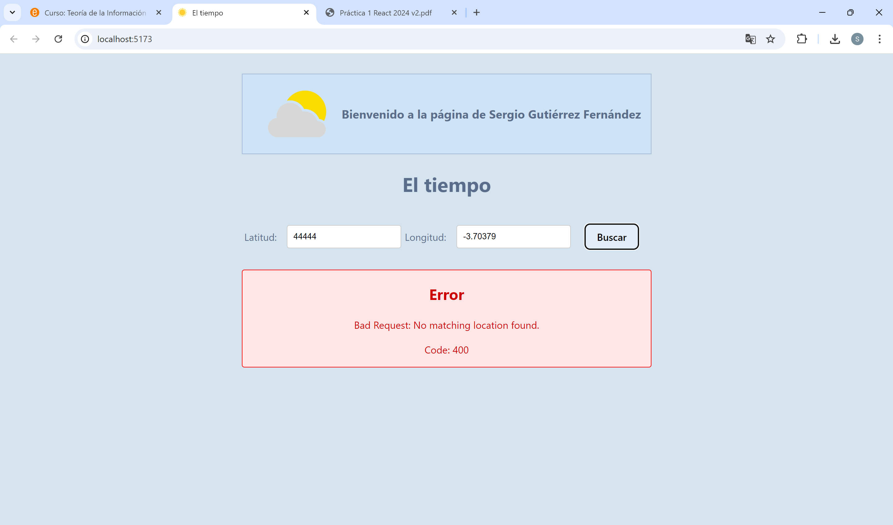
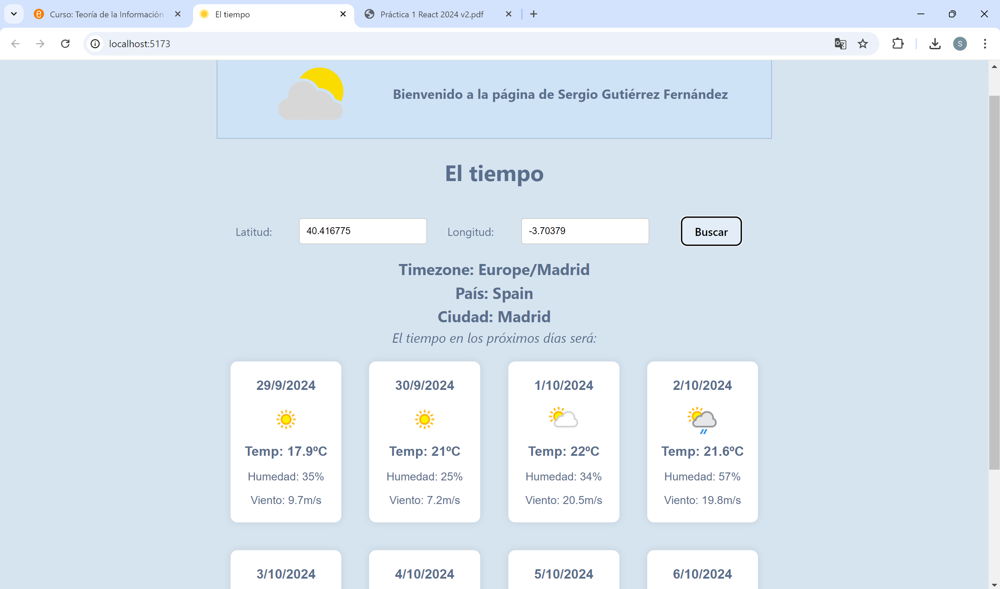

# 🌤 IWEB_p1_el-tiempo

> **ES**: Proyecto desarrollado en la asignatura de **Ingeniería Web** en 4º curso de **GITST** (Grado en Ingeniería de Tecnologías y Servicios de Telecomunicación) en la **ETSIT**.  
> **EN**: Project developed for the **Web Engineering** course in the 4th year of **GITST** (Degree in Engineering of Telecommunication Technologies and Services) at **ETSIT**.

---

## 📌 Descripción | Description

🟢 **ES:**  
_IWEB_p1_el-tiempo_ es una aplicación web para consultar el estado del tiempo en diferentes ubicaciones. Permite búsquedas de ciudades por **coordenadas geográficas** (latitud y longitud), mostrando información meteorológica actualizada y previsiones.

🔵 **EN:**  
_IWEB_p1_el-tiempo_ is a web application to check the weather conditions for different locations. It allows searching for cities by **geographical coordinates** (latitude and longitude), displaying real-time weather data and forecasts.

---

## 📸 Capturas de pantalla | Screenshots

🟢 **ES:** Aquí tienes una vista previa de la aplicación en acción.  
🔵 **EN:** Here’s a preview of the application in action.  

### ❌ Error al introducir coordenadas incorrectas | Error when entering incorrect coordinates
  
_🔴 La API devuelve un error cuando las coordenadas son inválidas._  
_🔵 The API returns an error when the coordinates are invalid._

### ✅ Búsqueda exitosa con datos del clima | Successful search with weather data
  
_🌍 Resultados correctos con información meteorológica detallada._  
_🌤 Correct results with detailed weather information._

---

## 🚀 Características | Features

✅ **ES:**  
✔️ Búsqueda de ciudades por **coordenadas geográficas** (latitud y longitud).  
✔️ Consulta del **clima actual** y su evolución.  
✔️ **Previsión meteorológica** para los próximos días.  
✔️ **Interfaz responsive**, moderna y fácil de usar.  

✅ **EN:**  
✔️ Search for cities by **geographical coordinates** (latitude and longitude).  
✔️ Get **real-time weather conditions**.  
✔️ **Weather forecast** for upcoming days.  
✔️ **Responsive interface**, modern and user-friendly.  

---

## 🛠️ Tecnologías | Technologies Used
- 🟡 **JavaScript (ES6+)** → Lenguaje principal del proyecto, usado para la lógica y las peticiones a la API.  
- 📄 **HTML5** → Estructura de la aplicación y renderizado en el navegador.  
- ⚛ **[React](https://reactjs.org/)** → Biblioteca de UI de JavaScript | JavaScript UI library.  
- ⚡ **[Vite](https://vitejs.dev/)** → Entorno de desarrollo rápido | Fast development environment.  
- 🌍 **API de Clima** → Datos meteorológicos en tiempo real | Real-time weather data.  
- 🎨 **CSS** → Diseño responsivo y atractivo | Responsive and stylish design.  

---

## 📦 Instalación | Installation

🟢 **ES:**  
Sigue estos pasos para instalar y ejecutar el proyecto:

```bash
git clone https://github.com/serguccierrez/IWEB_p1_el-tiempo.git
cd IWEB_p1_el-tiempo
npm install
npm run dev
```
Abre tu navegador en `http://localhost:3000`.

🔵 **EN:**  
Follow these steps to install and run the project:

```bash
git clone https://github.com/serguccierrez/IWEB_p1_el-tiempo.git
cd IWEB_p1_el-tiempo
npm install
npm run dev
```
Open your browser at `http://localhost:3000`.

---

## 📂 Estructura del Proyecto | Project Structure

```
IWEB_p1_el-tiempo/
├── public/         # Archivos estáticos | Static files
├── src/
│   ├── components/ # Componentes reutilizables | Reusable components
│   ├── assets/     # Recursos gráficos y estilos | Assets and styles
│   ├── App.jsx     # Componente principal | Main component
│   ├── main.jsx    # Punto de entrada | Entry point
├── package.json    # Dependencias | Dependencies
├── README.md       # Documentación | Documentation
```

---

## 📬 Contacto | Contact

📩 **serguccierrez** → [GitHub Profile](https://github.com/serguccierrez)  
Si tienes preguntas o sugerencias, crea un **issue** en este repositorio.  

If you have any questions or suggestions, feel free to open an **issue** in this repository.  

---

💡 _Made with ❤️ by **Serguccierrez**._
